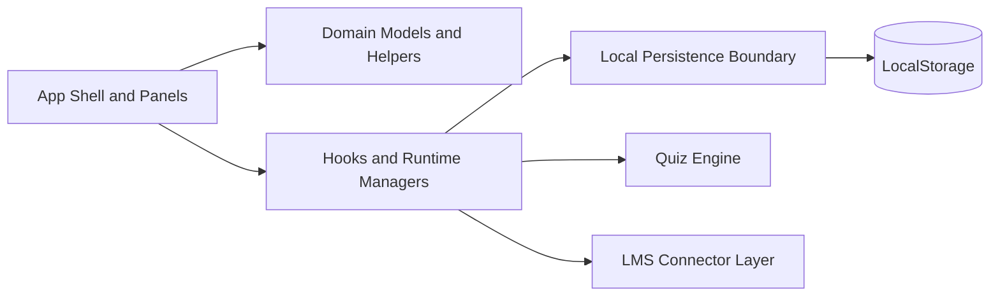

# Student Productivity Hub

[](https://nextjs.org/)
[](https://www.typescriptlang.org/)
[](https://authjs.dev/)
[](https://playwright.dev/)
[](#license)

A student-centric, research-oriented, mobile-first study operating system that integrates planning, focus workflows, quiz authoring, and learning analytics within a single extensible web application.

This repository is designed for three outcomes:

1. Support students in developing structured, autonomous, and transparent learning routines.
1. Equip educators and mentors with evidence-informed signals for mastery support.
1. Enable open-source contributors to build and evaluate learning technology responsibly.

## Table of Contents

- [Owner and Repository](#owner-and-repository)
- [Mission and Academic Positioning](#mission-and-academic-positioning)
- [Who This Is For](#who-this-is-for)
- [Product Snapshot](#product-snapshot)
- [System Architecture](#system-architecture)
- [Repository Layout](#repository-layout)
- [Quick Start](#quick-start)
- [Configuration and Environment](#configuration-and-environment)
- [Authentication and Authorization](#authentication-and-authorization)
- [Quiz Lab Interoperability](#quiz-lab-interoperability)
- [Research and Reproducibility](#research-and-reproducibility)
- [Contributor Onboarding](#contributor-onboarding)
- [Testing and Quality Gates](#testing-and-quality-gates)
- [Security Posture](#security-posture)
- [Operational Playbooks](#operational-playbooks)
- [Roadmap and Open Questions](#roadmap-and-open-questions)
- [Contributing](#contributing)
- [License](#license)

## Owner and Repository

- Repository owner: Arti Sri Ravikumar (`@aartisr`)
- Canonical repository: https://github.com/aartisr/student-productivity-hub

## Mission and Academic Positioning

Students frequently manage learning through disconnected tools: one application for tasks, one for focus, and one for quiz preparation, often without a coherent feedback loop. This project consolidates those workflows into a unified workspace where planning, effort, and assessment mutually reinforce one another.

Design principles:

- Student-first design, without sacrificing instructor visibility
- Mobile-first and distraction-aware interactions
- Role-aware access control (student, instructor, admin)
- Interoperability-first quiz workflows (import, export, and compatibility mapping)
- Reproducible, testable engineering workflows for academic and open-source settings

## Who This Is For

| Audience | Value |
| --- | --- |
| Students | A practical daily system to plan work, focus deeply, and measure progress |
| Instructors | Role-gated diagnostics and quiz tooling to improve learner outcomes |
| Researchers | A modifiable platform for studying learning behavior and intervention design |
| Contributors | A clean architecture and explicit quality gates for safe collaboration |

## Product Snapshot

| Domain | Capabilities |
| --- | --- |
| Authentication | OAuth via Auth.js with multi-provider federation |
| Core Productivity | Planner tasks, Pomodoro logs, GPA tooling, motivation prompts |
| Personalization | Module enable/disable, reordering, default landing, named profiles |
| Analytics | Session and productivity summaries across workflows |
| Data Portability | JSON export/import snapshots with local backup/restore |
| Quiz Lab | Lesson Studio, bank runtime, scoring history, mastery signals |
| Interoperability | GIFT, AIKEN, CSV, TSV, QTI 2.1 adapters and package checks |
| Instructor Tools | Blueprint constraints, item analysis, mastery bands, dry-run controls |

## System Architecture

The runtime follows a clean orchestration model where UI composition, domain logic, persistence, and external connectors are intentionally separated.



Primary implementation nodes:

- `app/page.tsx`: app shell and orchestration entrypoint
- `app/domain.ts`: shared domain types, constants, profiles, and pure utilities
- `app/persistence.ts`: storage boundary for load/save, backup, and restore
- `app/quizEngine.ts`: quiz model normalization, adapters, scoring, compatibility mapping
- `app/lmsConnectors.ts`: connector presets and dry-run validation

Architectural intent:

- Keep pedagogical logic independent of visual components.
- Enable rapid experimentation in hooks and domain utilities.
- Preserve stable import/export boundaries for educational interoperability.

## Repository Layout

```text
app/
  api/auth/[...nextauth]/route.ts      # Auth.js API route
  components/                          # UI panels and feature slices
  hooks/                               # State, orchestration, and workflow managers
  domain.ts                            # Core domain model and helpers
  persistence.ts                       # Local persistence boundary
  quizEngine.ts                        # Quiz logic and format adapters
tests/e2e/                             # Playwright end-to-end and responsive suites
wiki/                                  # User, operator, and troubleshooting documentation
```

## Quick Start

### Prerequisites

- Node.js 20+
- npm 10+

### Local Development

```bash
npm install
cp .env.example .env.local
npm run dev
```

Open: http://localhost:3000

Recommended first-run workflow:

1. Sign in with one OAuth provider.
1. Configure your module profile for your study style.
1. Create one lesson and one quiz in Quiz Lab.
1. Export a snapshot to validate backup and portability.

### Fast Restart for Auth or Env Changes

```bash
npm run dev:restart
```

## Configuration and Environment

Create `.env.local` from `.env.example` and configure at minimum:

| Variable | Required | Purpose |
| --- | --- | --- |
| `AUTH_SECRET` | Yes | Session/JWT signing key (must be strong in production) |
| `NEXTAUTH_URL` | Yes | Public application URL for callback/session consistency |
| Provider credentials | At least one | OAuth enablement (Google, GitHub, Entra ID, etc.) |
| `INSTRUCTOR_EMAILS` | Recommended | Comma-separated instructor allowlist |
| `ADMIN_EMAILS` | Recommended | Comma-separated admin allowlist |

Production behavior:

- The app fails fast in production when `AUTH_SECRET` is not configured.

## Authentication and Authorization

The platform uses Auth.js with HTTP-only session cookies and JWT session strategy.

### Supported OAuth Providers

- Google (`google`)
- Microsoft Entra ID (`azure-ad`)
- GitHub (`github`)
- Apple (`apple`)
- Facebook (`facebook`)
- LinkedIn (`linkedin`)
- X (`twitter`)
- Discord (`discord`)
- Slack (`slack`)
- GitLab (`gitlab`)

Callback template:

- `http://localhost:3000/api/auth/callback/<provider-id>`

Role model:

- Default role: `student`
- Elevated role mapping:
  - `INSTRUCTOR_EMAILS` -> `instructor`
  - `ADMIN_EMAILS` -> `admin`
- Role-gated areas:
  - LMS connector dry-run controls
  - Instructor mode controls

### Google OAuth Setup (Reference)

1. Create/select a Google Cloud project.
1. Configure OAuth consent screen.
1. Create OAuth client credentials for a web app.
1. Set authorized origin and callback URI:
   - `http://localhost:3000`
   - `http://localhost:3000/api/auth/callback/google`
1. Add credentials to `.env.local` and restart dev server.

## Quiz Lab Interoperability

The Quiz Lab subsystem is built for curriculum portability and format compatibility.

Supported import/export formats:

- Generic JSON
- Moodle GIFT
- AIKEN
- CSV (MCQ)
- TSV (flashcards)
- QTI 2.1 XML

QTI package safeguards:

- Manifest and file-reference integrity checks
- Parseability guardrails to catch malformed payloads early

Targeted compatibility guidance:

- Moodle, Canvas, Blackboard, Kahoot, Quizizz, Quizlet, Anki, Google Forms, Microsoft Forms, Schoology

## Research and Reproducibility

This project is intentionally structured for academic collaboration and empirical iteration.

Potential research threads include:

- How module personalization influences study consistency
- How spaced review and adaptive difficulty affect retention
- How integrated planning plus quiz feedback impacts completion rates

Reproducibility practices currently supported:

- Deterministic local setup with documented environment variables
- Versioned test suites for responsive and access-control behaviors
- Explicit data portability paths via JSON export/import

Recommended research workflow:

1. Define the behavioral question and measurable outcomes.
1. Implement feature changes behind clear module or role boundaries.
1. Validate functional behavior with typecheck, build, and E2E tests.
1. Document assumptions, limitations, and observed effects in wiki artifacts.

## Citation and Attribution

If this project contributes to academic work, please cite the repository and include a link to the exact commit hash used in your study.

Suggested citation template:

```text
Ravikumar, A. S. (2026). Student Productivity Hub (Version <commit-hash>) [Computer software].
https://github.com/aartisr/student-productivity-hub
```

For reproducible studies, report:

- repository URL
- commit hash
- environment assumptions
- test commands executed

## Contributor Onboarding

This repository welcomes student developers, educators, and research-oriented engineers.

### Fast Contributor Path (30-60 minutes)

1. Fork and clone the repository.
1. Run local setup (`npm install`, env file, `npm run dev`).
1. Run quality gates locally (`npm run verify`, Playwright smoke checks).
1. Pick one small-scoped change in UI text, documentation, or a focused hook.
1. Open a PR with a clear problem statement, rationale, and test notes.

### High-Value Contribution Areas

- Learning analytics clarity and interpretation UX
- Better import diagnostics for assessment formats
- Accessibility and responsive improvements for study sessions
- Authoring ergonomics in Lesson Studio and Quiz Lab workflows
- Documentation and runbook quality for classroom or lab deployment

### PR Quality Expectations

- Explain what changed and why it matters to student outcomes.
- Include before/after behavior, not only code-level details.
- Keep changes focused and reviewable.
- Validate with relevant tests and include command outputs in PR notes.

## Testing and Quality Gates

### Type and Build Verification

```bash
npm run typecheck
npm run verify
```

### E2E Responsive Validation

```bash
npx playwright install chromium
npm run test:e2e
```

Validated viewport matrix:

- `375x812` (iPhone 13 mini)
- `412x915` (Pixel 7)
- `768x1024` (iPad)
- `1366x768` (Laptop)
- `1920x1080` (Desktop)

Mobile smoke equivalent:

```bash
npx playwright test tests/e2e/auth-ux.spec.ts tests/e2e/access-control.spec.ts tests/e2e/responsive.spec.ts tests/e2e/responsive-visual.spec.ts --project=mobile-iphone-13-mini
```

Refresh visual baselines:

```bash
npx playwright test tests/e2e/responsive-visual.spec.ts --update-snapshots
```

Open test report:

```bash
npx playwright show-report
```

Minimum contributor gate:

- `npm run verify` must pass for all feature changes.
- If UI behavior changes, run at least one responsive and one auth/access suite.

## Security Posture

Secure defaults configured in `next.config.js`:

- `X-Content-Type-Options: nosniff`
- `X-Frame-Options: DENY`
- `Referrer-Policy: strict-origin-when-cross-origin`
- `Permissions-Policy` denies camera/microphone/geolocation by default

Operational security expectations:

- Keep allowlists minimal and role assignments explicit.
- Rotate provider secrets and `AUTH_SECRET` periodically.
- Treat exported snapshots as sensitive academic data.

## Operational Playbooks

Detailed operational and user documentation is maintained in the in-repo wiki:

- `wiki/Home.md`
- `wiki/Getting-Started.md`
- `wiki/Quickstart-Cheat-Sheet.md`
- `wiki/Quickstart-Wall-Poster.md`
- `wiki/Quickstart-Student.md`
- `wiki/Quickstart-Instructor.md`
- `wiki/Authentication-and-Roles.md`
- `wiki/Core-Workflows.md`
- `wiki/Quiz-Lab-Guide.md`
- `wiki/Data-Backup-and-Import.md`
- `wiki/Operator-and-Admin-Runbook.md`
- `wiki/Release-Gates-and-SLA.md`
- `wiki/Troubleshooting.md`
- `wiki/FAQ.md`

## Roadmap and Open Questions

Near-term roadmap focus:

- richer analytics and longitudinal insight
- deeper LMS integration beyond dry-run diagnostics
- additional interoperability pathways for assessment content
- stronger administrative observability and release gates

Open questions for community and research collaboration:

- Which student-facing metrics are helpful versus cognitively noisy?
- How should motivation interventions be personalized without overfitting?
- What interoperability layer best supports cross-institution adoption?
- Which accessibility improvements most improve sustained daily use?

## Contributing

Contributions are welcome via pull requests and issue discussions.

Recommended contribution flow:

1. Open an issue describing the problem, rationale, and expected behavior.
1. Propose implementation scope before large architectural changes.
1. Ensure `npm run verify` and critical Playwright suites pass before opening a PR.

Documentation-first contributions are encouraged. If you improve a workflow, update the related wiki page in the same contribution when possible.

## License

This project is currently **UNLICENSED**.

No permission is granted for use, modification, or distribution unless explicit written authorization is provided by the repository owner.
